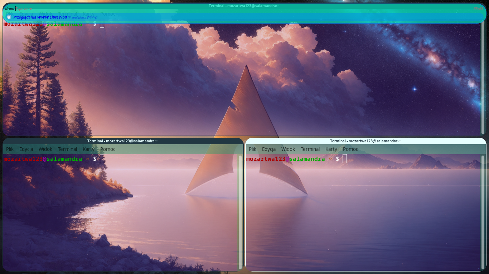
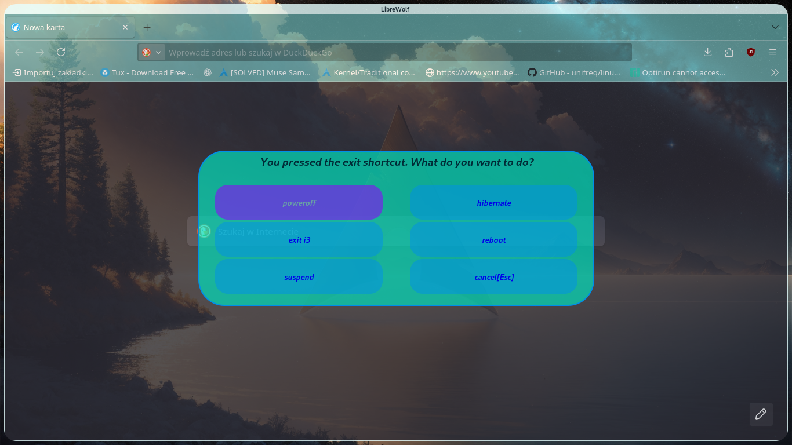
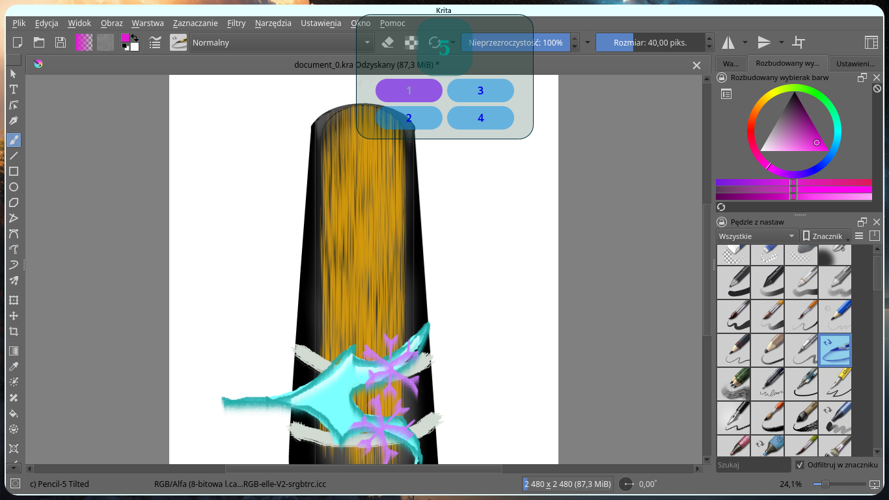
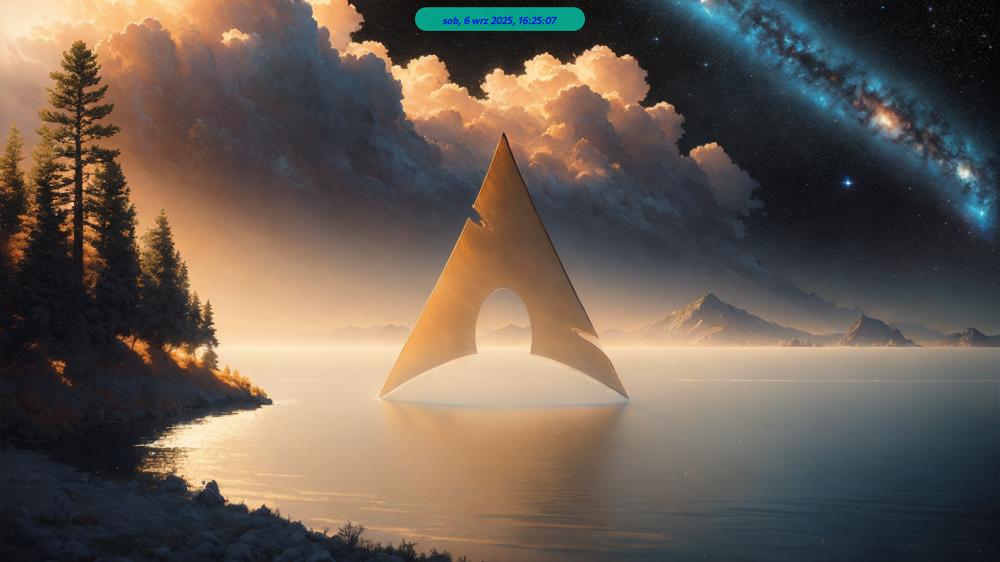

# i3-angelic-blue

 

 

It is my quite effective configuration of i3 window manager. It looks almost like default hyprland configuration (apart from gradient on window borders).

## Warning

It isn't a user friendly configuration. There is no bar by default. Everything is ewoked by shortcuts. This is setup working on my laptop and it is not widely tested yet. So lots off bugs can happen. UPPER PART coloured blue of librewolf on the one of screenshots is not by default - it is result of my modyfication of materia theme (https://github.com/nana-4/materia-theme)Transparent terminal is not alsa by default (in xfce4 terminal it is SIMPLE to do it - just click Edit->preferences->Appereance->Change opacity with slider). If you do not have default terminal, or file-browser (xfce4-terminal, thunar) you are supposed to change it in i3/config file, but it is not difficult.

## Dependencies

1. i3
2. rofi
3. jq (for parsing i3-msg -t get_workspaces output)
4. awk (or gawk)
5. picom
6. nm-connection-editor
7. Optional: Zafiro Nord Dark Blue icon theme https://www.pling.com/p/2014092 (you can use other icon-themes - see config.rasi for more information)
8. Optional: Cantarell and dejavu font (again you can change it)
9. Some terminal emulator (default xfce4-terminal)
10. Some file explorer (default thunar)
11. Pipewire or pulse-audio tools for changing sound volume (pactl is used for changing sound)
12. feh for wallpaper
13. Optional: materia theme (https://github.com/nana-4/materia-theme) - it is good for transparent thunar. I modify this theme to be more blue (and less transparent, because I saw nothing on the white background...), so I only changed some variables in scss... Maybe I will also shared this fork on github, but I made only some changes in scss file. But note - it need root accsess.

You do not need i3status and dmenu like in typical i3 setup.

On arch linux simply run:

    sudo pacman -Sy i3 rofi jq gawk picom ttf-dejavu cantarell-fonts nm-connection-editor xfce4-terminal thunar pipewire pipewire-audio pipewire-pulse pipewire-alsa pipewire-jack wireplumper pipewire-session-manager feh

Note: I never remember all needed pipewire packages...

## Install

No access to root is needed, so it is quite safe project. Simply move all directories in this project (rofi, i3, picom) to .config directory, for example you can open repo directory in terminal and run:

    for i in rofi picom i3; do mv $i ~/.config; done

Unfortunately I did not create instalation script, which could allow you to set terminal emulator, file browswer. But maybe I will add it.

## Features

+ Beautiful rounded corners and blue border, changing brightness when focused and unfocused
+ Cool animations (i use animation derived with picom package, because I am to lazy to make own picom animation from scratch)
+ Blue rofi menu
+ No bars, so the entire screen can be used for you window
+ Don't feel pression of running time, because the clock is hidden. But you can check time with shortcut WINDOWS (SUPER) KEY + SHIFT + D
+ Pop-up when sound volume is changing (you can change volume with WINDOWS + F11 for decreasing and WINDOWS + F12 for increasing - mutting and unmutting it is not implemented yet)
+ Good-looking exit menu (not this default ugly, old yellow bar...) - with options like reboot, suspend, itd... If you want hibernation edit rofi/exit_menu.sh comment 

    echo "[Error] : hibernation not implemented" | rofi -dmenu and uncomment 
        systemctl hibernate. 
    Then you are supposed to configure hibernation YOURSELF! I do not provide a script for this, but maybe I will do it in the future.
+ Awesome tool to change workspaces (WINDOWS (SUPER_KEY)+SHIFT+W)
+ Because bar is disabled you cannot use nm-applet (unless you enable...) you cannot use nm-applet. Luckily simply run WINDOWS (SUPER_KEY) + N to manage network with 
+ Some apps, like firefox, librewolf, vscode,  are a little bit transparent

Note: all rofi menus you can use only clicking arrow on the keybord. Clickable buttons are not implemented yet because it is really difficult in rofi to implement.

## Wallpaper:

It is NOT my work! Once, I downloaded it from the internet and I do not remember link to this wallpaper. If you know this link or you are an author please send it to me via issues or send it to me via email mozartwa123@gmail.com. You can change wallpaper with

    exec --no-startup-id feh --bg-scale path/to/the/wallpaper

In the .config/i3/config file

## Documentation:

I promise, I make it more precise. Please see all the config files, and read comments. There are some helpful informations.

## Polish translation

If you really need a polish translation (because I am polish) of this file, write me on github issue. I will write it easily.

## Important external links

+ i3 dokumentation: https://i3wm.org/docs/
+ picom dokumentation: https://github.com/yshui/picom/tree/next/man (+ man pages)
+ rofi dokumentation: https://davatorium.github.io/rofi/current/rofi.1/
+ video about i3-angelic-blue: https://youtu.be/B8aF2q7R3-0?si=Z2K3_cwFB7rBrcPr
# Enjoy:-D